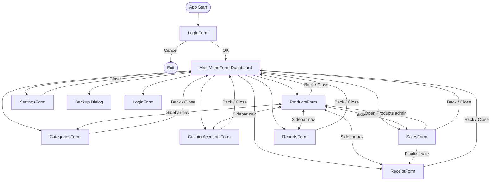

# Part I-C — System Planning / Interface Design

## Design approach

The UI follows a **shared workspace shell**:

- **Left:** Dark navy sidebar (220px) — store name, navigation links, “← Back to Menu” on child forms  
- **Right:** Light gray workspace — top bar (page title + user/subtitle), card-based content  
- **Theme:** `UiTheme.vb` — colors, fonts, spacing, buttons, grids  

All major forms use **responsive layouts** (`TableLayoutPanel`, `SplitContainer`) — no fixed pixel positioning for core content.

---

## Forms overview

| Form | File | Purpose | Roles |
|------|------|---------|-------|
| **Login** | `LoginForm.vb` | Sign in as Admin or Cashier | All |
| **Dashboard** | `MainMenuForm.vb` | KPIs, sales chart, navigation | All |
| **Point of Sale** | `SalesForm.vb` | Cart, discounts, tax, checkout | All |
| **Receipt Preview** | `ReceiptForm.vb` | History, preview, print/PDF | All |
| **Manage Products** | `ProductsForm.vb` | Product CRUD, CSV import, export | Admin |
| **Manage Categories** | `CategoriesForm.vb` | Category CRUD | Admin |
| **Manage Cashiers** | `CashierAccountsForm.vb` | Cashier account CRUD | Admin |
| **Reports** | `ReportsForm.vb` | Daily sales, top products, audit log | Admin |
| **Settings** | `SettingsForm.vb` | Store name, footer, currency | Admin |
| **Backup / Restore** | Inline dialog in `MainMenuForm.vb` | SQL backup/restore instructions | Admin |

Detailed control lists: [FORMS.md](../FORMS.md)

---

## Screenshots (for submission)

Place labeled PNG files in [screenshots/](screenshots/). Suggested set:

| # | Filename | Screen |
|---|----------|--------|
| 1 | `01-login.png` | LoginForm — role selection |
| 2 | `02-dashboard.png` | MainMenuForm — KPIs + chart |
| 3 | `03-products.png` | ProductsForm — grid + editor |
| 4 | `04-categories.png` | CategoriesForm |
| 5 | `05-cashiers.png` | CashierAccountsForm |
| 6 | `06-pos.png` | SalesForm — cart + checkout |
| 7 | `07-receipt.png` | ReceiptForm — preview + history |
| 8 | `08-reports.png` | ReportsForm — daily revenue |
| 9 | `09-settings.png` | SettingsForm |
| 10 | `10-audit-log.png` | ReportsForm — Audit Log tab |

Capture at **1920×1080** or maximized window. Include visible **sidebar + top bar** for consistency.

---

## Navigation flow



**Behavior:** Child forms open **modally**; main menu hides while a module is open. Sidebar links on child forms **switch modules** via `WorkspaceNavigation` (single click). “← Back to Menu” returns to dashboard.

---

## Sidebar / menu design

### Dashboard sidebar (`MainMenuForm`)

**Top section (primary nav):**
- Manage Products  
- Manage Categories  
- Manage Cashiers *(admin only)*  
- Point of Sale  
- Receipt Preview  
- Reports *(admin only)*  

**Bottom section (utilities):**
- Settings *(admin only)*  
- Backup / Restore *(admin only)*  
- Log out *(danger styling)*  

### Workspace sidebar (all module forms)

Same nav items as above, with **current screen highlighted**. Footer: **← Back to Menu**.

Cashiers see only: **Point of Sale**, **Receipt Preview**, **Log out** (and Back on those forms).

---

## Interface sketches (text wireframes)

### Login
```
┌─────────────────────────────────────────┐
│         [Logo or App Title]               │
│         Sign in to continue               │
│  ( ) Administrator  ( ) Cashier         │
│  Username: [________]  (cashier only)   │
│  Password: [________] [👁]              │
│         [ Sign In ]  [ Cancel ]         │
└─────────────────────────────────────────┘
```

### Dashboard
```
┌──────────┬──────────────────────────────────────────┐
│ Store    │ Dashboard                                │
│ Name     │ System Status: ● Online                  │
│          ├──────────────────────────────────────────┤
│ Products │ [Low stock alert: N]  (if any)           │
│ Categ.   │ ┌────┐ ┌────┐ ┌────┐ ┌────┐              │
│ Cashiers │ │KPI │ │KPI │ │KPI │ │KPI │              │
│ POS      │ └────┘ └────┘ └────┘ └────┘              │
│ Receipt  │ [Chart filters: From | To | Preset]      │
│ Reports  │ ┌──────────────────────────────────────┐   │
│          │ │     Daily sales bar chart            │   │
│ Settings │ └──────────────────────────────────────┘   │
│ Backup   │                                              │
│ Log out  │                                              │
└──────────┴──────────────────────────────────────────┘
```

### Point of Sale
```
┌──────────┬─────────────────────┬─────────────────────┐
│ Sidebar  │ Product cards       │ Shopping cart       │
│          │ [filter] [search]   │ [Remove] [Clear]    │
│          │ ┌──┐ ┌──┐ ┌──┐      │ ┌─────────────────┐ │
│          │ └──┘ └──┘ └──┘      │ │ line items grid │ │
│          │ Qty [1] [Add cart]  │ └─────────────────┘ │
│          │                     │ Discount | Tax      │
│          │                     │ Subtotal / Total    │
│          │                     │ [ FINALIZE SALE ]   │
└──────────┴─────────────────────┴─────────────────────┘
```

---

## Color & typography (summary)

| Token | Use |
|-------|-----|
| `#1E3A6E` (ColPrimary) | Sidebar, primary buttons, headings |
| `#F4F6F9` (ColBackground) | Page background |
| `#FFFFFF` (ColSurface) | Cards, inputs |
| `#2E7D32` (ColAccent) | Success / Finalize sale |
| `#C62828` (ColDanger) | Delete, logout, errors |
| Segoe UI 18pt bold | Page titles (FontDisplay) |
| Segoe UI 9pt | Body text (FontBody) |

Full tokens: `GroupC/UiTheme.vb`
