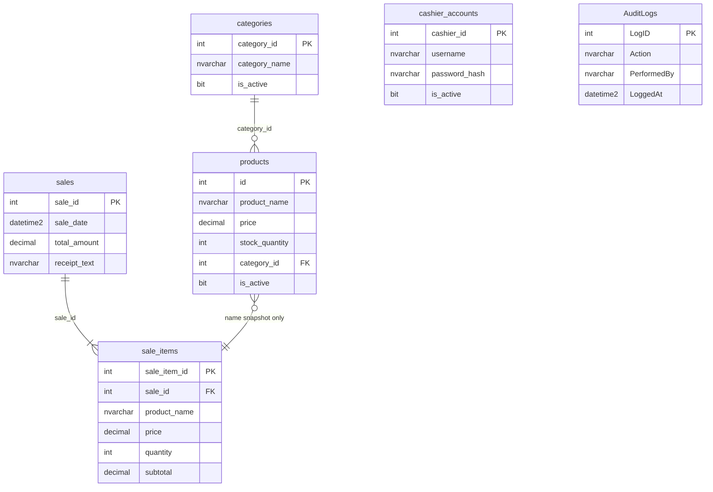

# Part I-D — Database Design

## Database overview

| Property | Value |
|----------|--------|
| **DBMS** | Microsoft SQL Server LocalDB |
| **Instance** | `(localdb)\MSSQLLocalDB` |
| **Database name** | `GroupC_DB` |
| **Connection** | `GroupC/App.config` → `GroupCSqlServer` |
| **Schema authority** | `GroupC/DatabaseInitializer.vb` (runtime DDL) |
| **Reference scripts** | `GroupC/scripts/01_create_database.sql`, `02_create_tables.sql`, seed scripts |

The app **creates the database and tables automatically** on first run when LocalDB is available.

---

## Entity relationship (logical)



**Note:** `sale_items` stores a **snapshot** of `product_name` and `price` at sale time — not a foreign key to `products.id`. This preserves history if products are renamed or deactivated.

---

## Tables (actual schema)

> Instructor handout used simplified names (`product_id`, `stock_qty`, `audit_log`). This project uses the **actual column names** below. Map them in your oral defense as equivalent concepts.

### `categories`

| Column | Type | Constraints | Description |
|--------|------|-------------|-------------|
| `category_id` | INT | PK, IDENTITY | Unique category ID |
| `category_name` | NVARCHAR(100) | NOT NULL, UNIQUE | Display name |
| `is_active` | BIT | DEFAULT 1 | 1 = active, 0 = deactivated |

---

### `products`

| Column | Type | Constraints | Description |
|--------|------|-------------|-------------|
| `id` | INT | PK, IDENTITY | Product ID *(handout: product_id)* |
| `product_name` | NVARCHAR(100) | NOT NULL, UNIQUE | Product name |
| `price` | DECIMAL(10,2) | NOT NULL, > 0 | Unit price |
| `stock_quantity` | INT | NOT NULL, DEFAULT 100 | On-hand stock *(handout: stock_qty)* |
| `category_id` | INT | NULL, FK → categories | Optional category |
| `is_active` | BIT | DEFAULT 1 | Soft delete flag |
| `image_path` | NVARCHAR(260) | NULL | Optional product image path |
| `created_at` | DATETIME2 | DEFAULT SYSUTCDATETIME() | Created timestamp |
| `updated_at` | DATETIME2 | DEFAULT SYSUTCDATETIME() | Last update |

**Indexes:** unique on `product_name`; FK on `category_id`

---

### `sales`

| Column | Type | Constraints | Description |
|--------|------|-------------|-------------|
| `sale_id` | INT | PK, IDENTITY | Sale / receipt number |
| `sale_date` | DATETIME2 | NOT NULL, DEFAULT SYSUTCDATETIME() | Transaction time (UTC stored) |
| `total_amount` | DECIMAL(10,2) | NOT NULL | Grand total *(handout: total)* |
| `receipt_text` | NVARCHAR(MAX) | NULL | Full formatted receipt snapshot |
| `subtotal_before_discount` | DECIMAL(10,2) | NULL | Pre-discount subtotal |
| `discount_percent` | DECIMAL(5,2) | NULL | Discount rate applied |
| `discount_amount` | DECIMAL(10,2) | NULL | Discount peso amount |
| `amount_before_tax` | DECIMAL(10,2) | NULL | Subtotal after discount |
| `tax_percent` | DECIMAL(5,2) | NULL | VAT rate if applied |
| `tax_amount` | DECIMAL(10,2) | NULL | Tax amount |
| `amount_tendered` | DECIMAL(10,2) | NULL | Cash tendered *(handout: tendered)* |
| `change_given` | DECIMAL(10,2) | NULL | Change due *(handout: change)* |
| `created_at` | DATETIME2 | DEFAULT SYSUTCDATETIME() | Row created |

---

### `sale_items`

| Column | Type | Constraints | Description |
|--------|------|-------------|-------------|
| `sale_item_id` | INT | PK, IDENTITY | Line ID *(handout: item_id)* |
| `sale_id` | INT | NOT NULL, FK → sales | Parent sale |
| `product_name` | NVARCHAR(100) | NOT NULL | Name at time of sale |
| `price` | DECIMAL(10,2) | NOT NULL | Unit price snapshot *(handout: unit_price)* |
| `quantity` | INT | NOT NULL | Quantity sold |
| `subtotal` | DECIMAL(10,2) | NOT NULL | quantity × price |
| `created_at` | DATETIME2 | DEFAULT SYSUTCDATETIME() | Row created |

**FK:** `sale_id` → `sales.sale_id` ON DELETE CASCADE  
**Index:** `IX_sale_items_sale_id`

---

### `cashier_accounts`

| Column | Type | Constraints | Description |
|--------|------|-------------|-------------|
| `cashier_id` | INT | PK, IDENTITY | Account ID *(handout: account_id)* |
| `username` | NVARCHAR(50) | NOT NULL, UNIQUE | Login username |
| `password_hash` | NVARCHAR(256) | NOT NULL | Hashed password |
| `password_salt` | NVARCHAR(64) | NOT NULL | Salt for hash |
| `display_name` | NVARCHAR(100) | NULL | Shown on receipts |
| `is_active` | BIT | DEFAULT 1 | Account enabled |
| `created_at` | DATETIME2 | DEFAULT SYSUTCDATETIME() | Registered |
| `last_login_at` | DATETIME2 | NULL | Last successful login |

---

### `AuditLogs`

Admin/system audit trail shown in **Reports → System Audit Logs**.

| Column | Type | Constraints | Description |
|--------|------|-------------|-------------|
| `LogID` | INT | PK, IDENTITY | Log entry ID *(handout: log_id)* |
| `Action` | NVARCHAR(100) | NOT NULL | Event type *(handout: action)* |
| `Detail` | NVARCHAR(MAX) | NULL | Description |
| `PerformedBy` | NVARCHAR(100) | NULL | Username / role |
| `LoggedAt` | DATETIME2 | DEFAULT SYSUTCDATETIME() | Timestamp *(handout: logged_at)* |

---

### `audit_products` / `audit_sales`

Domain-specific audit tables for product and sale lifecycle (used by `AuditLogger.LogProduct` / `LogSale`).

| Table | Key columns |
|-------|-------------|
| `audit_products` | `audit_id`, `occurred_at`, `action_code`, `product_id`, `product_name`, `detail` |
| `audit_sales` | `audit_id`, `occurred_at`, `action_code`, `sale_id`, `detail` |

---

### `error_log`

Application exception log (not shown in UI).

| Column | Type | Description |
|--------|------|-------------|
| `log_id` | INT PK | Error ID *(handout: error_id)* |
| `occurred_at` | DATETIME2 | When logged |
| `source` | NVARCHAR(200) | Code location |
| `message` | NVARCHAR(MAX) | Exception message *(handout: message)* |
| `stack_trace` | NVARCHAR(MAX) | Stack trace |

Also written to `%LocalAppData%\GroupC\logs\app.log`.

---

## Mapping to instructor table names

| Instructor handout | This project |
|--------------------|--------------|
| `products.product_id` | `products.id` |
| `products.name` | `products.product_name` |
| `products.stock_qty` | `products.stock_quantity` |
| `sale_items.item_id` | `sale_items.sale_item_id` |
| `sale_items.product_id` | *(not stored — name/price snapshot only)* |
| `cashier_accounts.account_id` | `cashier_accounts.cashier_id` |
| `audit_log` | `AuditLogs` (+ `audit_products`, `audit_sales`) |
| `sales.created_at` | `sales.sale_date` + `sales.created_at` |

---

## Sample queries (demo / verification)

**Count active products:**
```sql
SELECT COUNT(*) FROM products WHERE is_active = 1;
```

**Today's sales total:**
```sql
SELECT ISNULL(SUM(total_amount), 0)
FROM sales
WHERE CAST(sale_date AS DATE) = CAST(GETDATE() AS DATE);
```

**Daily revenue report:**
```sql
SELECT CAST(sale_date AS DATE) AS sale_day,
       COUNT(*) AS sale_count,
       SUM(total_amount) AS revenue
FROM sales
WHERE sale_date >= @from AND sale_date < @to
GROUP BY CAST(sale_date AS DATE)
ORDER BY sale_day;
```

**Low stock products:**
```sql
SELECT product_name, stock_quantity
FROM products
WHERE is_active = 1 AND stock_quantity <= 5;
```

---

## Settings (non-database)

Store branding also stored in JSON: `%LocalAppData%\GroupC\settings.json` via `AppSettings.vb` (store name, footer, currency, branch, policies, stock threshold).
